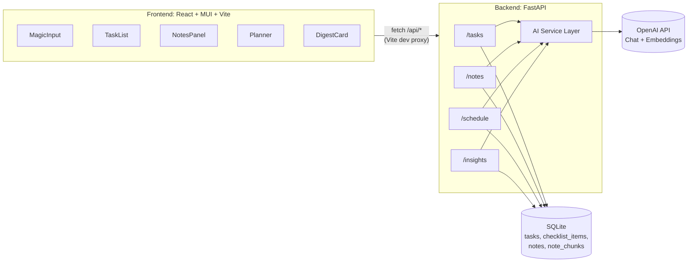

# Архитектура проекта "AI-Органайзер"

Документ фиксирует стек технологий и архитектуру приложения перед
началом реализации. Источник требований: [spec.md](spec.md).

## Ключевые решения

- Реализуется **весь функционал спецификации**: Magic Input,
  AI-декомпозиция задач, AI-заметки с семантическим поиском,
  адаптивный планировщик, вечерний AI-дайджест.
- Режим работы: **однопользовательский, локальный**, без
  регистрации и логина.
- Архитектура: отдельные **backend** (FastAPI) и **frontend**
  (React + MUI, Vite), взаимодействующие по REST API.
- **Контейнеризация**: Docker + Docker Compose для изоляции
  окружения и упрощения развёртывания (опционально, доступен
  также локальный запуск без Docker).

## Стек технологий

### Backend

- **Python 3** — язык реализации.
- **FastAPI** — REST API, асинхронность, автогенерация OpenAPI.
- **SQLAlchemy** — ORM поверх **SQLite** (файл БД).
- **Pydantic / pydantic-settings** — схемы запросов/ответов и
  конфигурация из `.env`.
- **OpenAI Python SDK** — интеграция с моделями:
  - `OPENAI_CHAT_MODEL` (`gpt-4o-mini`) — парсинг, декомпозиция,
    автотеги, форматирование текста, reschedule, дайджест;
  - `EMBEDDING_MODEL` (`text-embedding-3-small`) — эмбеддинги для
    семантического поиска по заметкам.
- **uvicorn** — ASGI-сервер.
- **Совместимость OpenAI SDK** — для `openai==1.47.0`
  зафиксирован `httpx==0.27.2`. Обновление одной из этих библиотек
  должно сопровождаться проверкой совместимости и пересборкой образа.
- **logging** (стандартная библиотека) — вместо `print`.
- **ruff / black / isort** — линтер и форматтер, `line-length = 79`
  под принятые стайл-правила.

### Frontend

- **Node.js + npm** — окружение и пакетный менеджер.
- **React** — UI-библиотека.
- **Material UI v6 (MUI)** — компоненты интерфейса; кастомная тема
  (`src/theme.js`): шрифт Inter, цветовая схема indigo (`#4f46e5`) /
  emerald (`#10b981`), переопределения Button, Paper, Chip, Tab.
- **@fontsource/inter** — самохостируемый шрифт Inter (400, 600),
  подключён в `src/main.jsx`; не CDN.
- **Vite** — сборка и dev-сервер (`npm run dev/build/preview`).
- **ESLint + Prettier** — линтер и форматтер JS/JSX.
- **localStorage** — хранение истории последних введённых строк
  Magic Input на клиенте (не основное хранилище данных).

### Хранение данных

- **SQLite** — единственный источник истины для задач, чек-листов
  и заметок (файл `backend/data/ai_organizer.db`).
- Векторный поиск не выносится во внешнюю БД: эмбеддинги хранятся
  как JSON-поле в SQLite, косинусная близость считается в Python
  (достаточно для локального однопользовательского масштаба).
- **Персистентность в Docker**: база данных создаётся в папке
  `backend/data/`, которая монтируется как Docker volume.
  Это гарантирует сохранение данных между пересборками контейнеров.

### Контейнеризация (Docker)

- **Docker** — для изоляции окружения и воспроизводимых сборок.
- **Docker Compose** — оркестрация backend и frontend контейнеров.
- **Два режима**:
  - `docker-compose.yml` — development с hot-reload и volume
    mount для исходников.
  - `docker-compose.prod.yml` — production с nginx для frontend
    и оптимизированными образами.
- **Multi-stage builds** — frontend собирается через промежуточный
  образ builder, итоговый production образ содержит только
  статику + nginx (легковесный).
- **Vite HMR в Docker**: для корректной работы Hot Module
  Replacement в контейнере требуется явная конфигурация
  `hmr.clientPort` и `hmr.host` в `vite.config.js`, а также
  `watch.usePolling` для надежного отслеживания изменений файлов.

## Архитектурная диаграмма



В dev-режиме через Docker фронтенд обращается к бэкенду через прокси
Vite (`/api -> http://backend:18080`). Имя `backend` доступно только
внутри Docker-сети; браузер обращается к frontend на
`http://localhost:5173`. CORS middleware на бэкенде всё равно
включается для устойчивости при других сценариях запуска.

После изменения `backend/requirements.txt` Docker-образ backend
пересобирается без кэша:

```bash
docker compose build --no-cache backend
docker compose up -d backend
```

Это обязательно при изменении версий OpenAI SDK и его HTTP-зависимостей:
иначе контейнер может продолжить запускаться со старым слоем зависимостей.

**Конфигурация Vite для Docker** (`frontend/vite.config.js`):
```javascript
server: {
  port: 5173,
  host: '0.0.0.0',
  hmr: {
    clientPort: 5173,
    host: 'localhost',
  },
  watch: {
    usePolling: true,
  },
  proxy: { ... }
}
```
Параметры `hmr` обеспечивают корректную работу Hot Module Replacement
через WebSocket соединение между браузером и Vite dev-сервером в
контейнере. `usePolling` необходим для надежного отслеживания
изменений файлов через volume mount.

Роутер задач FastAPI объявлен с завершающим `/`. Поэтому frontend
должен использовать `/api/tasks/` для коллекции задач (GET, POST и
DELETE all). Запрос без завершающего `/` получает HTTP 307 и может
перенаправить браузер на внутренний адрес `backend:18080`, который
недоступен с хост-машины.

Компоненты MUI, содержащие вложенные элементы в `ListItemText.secondary`,
должны использовать `component="span"` на всех узлах (свойство
`secondary` оборачивается в `<p>`, блочные дочерние теги нарушают
DOM-вложенность). Пример правильного использования — `TaskItem.jsx`.

### Паттерны компонентов (зафиксированы после рефакторинга UI/UX)

**Persistent tabs** — все три панели всегда монтируются в DOM; активная
отображается через `sx={{ display: currentTab === N ? 'block' : 'none' }}`.
Это предотвращает повторные fetch при переключении вкладок и сохраняет
локальный стейт.

**ConfirmDialog** — единственный способ подтверждения деструктивных
действий. `window.confirm` запрещён в пользу компонента
`ConfirmDialog.jsx` (`open`, `title`, `message`, `onConfirm`, `onCancel`,
`severity`).

**Прямой импорт api** — каждый компонент импортирует
`api` из `'../api/client.js'` напрямую; передача `api` через props
запрещена. Это устраняет prop-drilling и упрощает рефакторинг.

**Утилиты форматирования** — `formatDue`, `formatDate`, `getPriorityColor`
вынесены в `src/utils.js`; компоненты не дублируют эту логику.

## Структура проекта

```
02-AI_Organaizer/
  spec.md
  architecture.md
  .env                  # существующий, с секретами (в .gitignore)
  .env.example          # шаблон без секретов
  .gitignore
  README.md
  backup_db.py               # скрипт резервного копирования БД
  backup_db.bat              # Windows-обёртка для backup_db.py
  backup_db.sh               # Linux/macOS-обёртка для backup_db.py
  docker-compose.yml         # Docker Compose для development
  docker-compose.prod.yml    # Docker Compose для production
  backups/                   # папка с резервными копиями (в .gitignore)
  backend/
    data/                    # персистентные данные (Docker volume)
      ai_organizer.db        # SQLite база данных
    app/
      main.py            # FastAPI app, CORS, роутеры, логирование
      exceptions.py      # OpenAIServiceError и HTTP-маппинг
      config.py           # pydantic-settings, читает .env
      database.py          # SQLAlchemy engine/session
      models.py             # Task, ChecklistItem, Note, NoteChunk
      schemas.py             # Pydantic-схемы запросов/ответов
      routers/
        tasks.py
        notes.py
        schedule.py
        insights.py
      services/
        openai_client.py     # обёртка над OpenAI SDK
        capture.py            # парсинг Magic Input -> задача
        decompose.py           # разбивка задачи на шаги/подсказки
        notes_ai.py             # автотеги, связи, форматирование
        embeddings.py            # embeddings, cosine similarity
        scheduler.py              # приоритеты (Эйзенхауэр), reschedule
        digest.py                  # вечерний дайджест
    requirements.txt
    pyproject.toml         # ruff/black/isort (line-length=79)
    Dockerfile             # образ для backend
    .dockerignore
  frontend/
    src/
      main.jsx              # точка входа, импорт @fontsource/inter
      App.jsx               # persistent tabs, ConfirmDialog
      theme.js              # кастомная MUI тема (Inter, indigo/emerald)
      utils.js              # formatDue, formatDate, getPriorityColor
      api/client.js         # fetch-обёртка, baseURL через Vite proxy
      components/
        MagicInput.jsx      # Escape/click-outside, кнопка очистки истории
        TaskList.jsx / TaskItem.jsx  # due_at, цветная полоса приоритета
        ChecklistDialog.jsx
        ConfirmDialog.jsx   # заменяет window.confirm во всех компонентах
        NotesPanel.jsx / NoteEditor.jsx / AskNotesBar.jsx
        Planner.jsx           # матрица Эйзенхауэра / фокус на день
        DigestCard.jsx
        ErrorAlert.jsx / EmptyState.jsx
    vite.config.js         # dev-proxy /api -> backend:18080
    package.json
    eslint.config.js / .prettierrc
    Dockerfile             # multi-stage образ для frontend
    .dockerignore
    nginx.conf             # конфигурация nginx для production
```

## Модель данных (SQLite)

| Сущность | Поля |
| --- | --- |
| **Task** | `id, title, raw_input, description, due_at, tag, is_urgent, is_important, status(pending/in_progress/done), completed_at, created_at, updated_at` |
| **ChecklistItem** | `id, task_id (FK), text, is_done, position, created_at` |
| **Note** | `id, title, content, tags(JSON), linked_task_id (FK, nullable), created_at, updated_at` |
| **NoteChunk** | `id, note_id (FK), text, embedding(JSON[float])` |

Заметка режется на абзацы; каждый абзац (`NoteChunk`) получает свой
embedding, чтобы семантический поиск находил конкретный релевантный
фрагмент, а не всю заметку целиком.

`completed_at` заполняется при переводе задачи в статус `done` и
очищается, если задача снова открыта. Поле нужно вечернему дайджесту
для расчёта продуктивного времени. Для уже существующих SQLite-файлов
колонка добавляется при старте приложения (`ensure_schema`).

Вечерний дайджест кэшируется в памяти процесса на календарный день
(`GET /insights/digest`); параметр `refresh=true` пересобирает отчёт.
При расчёте процента выполнения за день учитывается прогресс по
подзадачам: задача с выполненными 5 из 10 пунктов чек-листа считается
как 50% выполненной.

### Резервное копирование и защита данных

**Проблема:** До версии от 03.09.2026 база данных создавалась в корне
проекта (`ai_organizer.db`), что приводило к потере данных при
пересборке Docker-контейнеров, так как файл находился вне
замонтированного volume.

**Решение (реализовано):**
1. **Путь к БД изменён** в `backend/app/config.py`:
   ```python
   DB_DIR = Path(__file__).parent.parent / "data"
   DB_DIR.mkdir(exist_ok=True)
   DB_FILE = DB_DIR / "ai_organizer.db"
   ```
2. База данных теперь создаётся в `backend/data/ai_organizer.db`,
   которая замонтирована как volume в `docker-compose.yml`:
   ```yaml
   volumes:
     - ./backend/data:/app/data
   ```
3. Данные сохраняются на хост-машине и переживают пересборку
   контейнеров, остановку и удаление контейнеров.

**Автоматическое резервное копирование:**

Для дополнительной защиты данных в корне проекта добавлены скрипты:
- `backup_db.py` — Python-скрипт резервного копирования
- `backup_db.bat` — Windows-обёртка (запуск двойным кликом)
- `backup_db.sh` — Linux/macOS-обёртка

Скрипт автоматически:
- Создаёт копию БД с временной меткой в папке `backups/`
- Хранит последние 10 резервных копий
- Удаляет копии старше 30 дней

Для автоматизации можно настроить Task Scheduler (Windows) или
cron (Linux/macOS) для ежедневного запуска.

## Точки интеграции с OpenAI

1. **Magic Input** — парсинг свободного текста в структурированную
   задачу (`title`, `due_at`, `tag`).
2. **Декомпозиция задач** — генерация чек-листа шагов и
   контекстных подсказок по недостающим подзадачам; пользователь
   может добавлять, редактировать и удалять подзадачи.
3. **Автотегирование заметок** — теги и предложение связей с
   задачами/проектами при создании/редактировании заметки.
4. **Семантический поиск** — эмбеддинги вопроса и абзацев заметок,
   выдача релевантных фрагментов с AI-ответом ("Спроси свои заметки").
5. **Быстрое форматирование** — summary / исправление грамматики /
   смена тона для выделенного фрагмента заметки.
6. **Smart Rescheduling** — анализ загруженности дня и предложение
   нового окна для просроченной задачи.
7. **Вечерний дайджест** — агрегация статистики дня (% выполнения
   с учётом прогресса по подзадачам, продуктивные часы) и генерация
   текстового отчёта-рекомендации.

## API (обзор эндпоинтов)

- `GET/POST/PATCH/DELETE /tasks`, `DELETE /tasks` (очистить список)
- `POST /tasks/parse` — Magic Input -> черновик задачи
- `POST /tasks/{id}/decompose` — генерация чек-листа
- `POST /tasks/{id}/reschedule` — предложение нового времени
- `GET/POST/PATCH/DELETE /notes`
- `POST /notes/ask` — семантический поиск по заметкам
- `POST /notes/{id}/transform` — summary/грамматика/тон
- `GET /schedule/today` — приоритеты дня (матрица Эйзенхауэра)
- `GET /insights/digest` — вечерний AI-дайджест

## Примечания

- `.env` уже содержит боевой ключ OpenAI — обязательно должен быть
  добавлен в `.gitignore`; в репозиторий попадает только
  `.env.example` без секретов.
- База данных и резервные копии (`*.db`, `backups/`) также исключены
  из git через `.gitignore`.
- **Важно**: при изменении `backend/requirements.txt` необходимо
  пересобрать Docker-образ backend с флагом `--no-cache`, чтобы
  избежать использования кэшированного слоя зависимостей.
- Настоящий документ фиксирует архитектуру на момент планирования;
  при изменении решений в ходе реализации файл следует обновлять.

## История изменений

### 03.09.2026 — UI/UX + Backend рефакторинг

**Тема и типографика:**
- `theme.js` полностью переписан: палитра indigo/emerald, шрифт Inter
  через `@fontsource/inter` (400, 600), `shape.borderRadius: 12`,
  переопределения MuiButton, MuiPaper, MuiChip, MuiTab.
- `@fontsource/inter` добавлен в `package.json`, импортируется в
  `main.jsx`; CDN не используется.

**App.jsx — persistent tabs и header:**
- Условный рендер `{currentTab === N && <Panel />}` заменён на
  `<Box sx={{ display: currentTab === N ? 'block' : 'none' }}>` для
  всех трёх панелей; данные загружаются один раз при монтировании.
- Добавлен чип-статус с количеством открытых задач.
- `window.confirm` в `handleClearAll` заменён на `ConfirmDialog`.

**Новые файлы:**
- `src/utils.js` — `formatDue` (относительная дата: "сегодня 14:00",
  "завтра 09:30", "5 дн. назад"), `formatDate`, `getPriorityColor`.
- `src/components/ConfirmDialog.jsx` — MUI Dialog для подтверждения
  деструктивных действий; заменяет `window.confirm` везде в проекте.

**TaskItem.jsx:**
- Цветная левая полоска: красная (urgent+important), amber (urgent),
  indigo (important), серая (остальные) — через `getPriorityColor`.
- `due_at` отображается под описанием с иконкой ⏰; красный цвет
  при просрочке.
- Добавлен чип приоритета (срочно / важно / важно+срочно).

**MagicInput.jsx:**
- Закрытие выпадающей истории по Escape и клику вне компонента
  (`mousedown` listener через `useRef`).
- Кнопка очистки всей истории.
- Обновлён placeholder с примером запроса.

**Устранение prop-drilling api:**
- Все компоненты (`TaskList`, `TaskItem`, `ChecklistDialog`,
  `NotesPanel`, `NoteEditor`, `AskNotesBar`, `Planner`, `DigestCard`)
  импортируют `api` напрямую из `'../api/client.js'`; `api` удалён
  из пропсов и цепочки передачи в `App.jsx`.

**api/client.js:**
- `Content-Type: application/json` добавляется только при наличии
  тела запроса (`body !== undefined`); GET и DELETE-запросы отправляют
  только `Accept: application/json`.

**routers/tasks.py — идемпотентность декомпозиции:**
- Перед созданием новых пунктов чек-листа удаляются все существующие
  для данной задачи; повторный вызов "Разбить на шаги" не накапливает
  дублирующие пункты.

### 03.09.2026 — Исправление персистентности данных и HMR в Docker

**Проблема 1 (персистентность данных):** База данных создавалась вне
Docker volume, что приводило к потере данных при пересборке
контейнеров.

**Изменения:**
- Изменён путь к БД в `backend/app/config.py` с корня проекта на
  `backend/data/ai_organizer.db`
- Добавлены скрипты автоматического резервного копирования
  (`backup_db.py`, `backup_db.bat`, `backup_db.sh`)
- Обновлена документация с инструкциями по резервному копированию

**Результат:** Данные теперь сохраняются между пересборками
контейнеров. Добавлена возможность автоматического резервного
копирования с ротацией старых копий.

**Проблема 2 (HMR в Docker):** Ошибка `ERR_CONNECTION_RESET` при
попытке подключения к `@react-refresh`, пустой интерфейс приложения.
Vite dev-сервер не мог корректно установить WebSocket соединение для
Hot Module Replacement из-за отсутствия явной конфигурации для Docker.

**Изменения:**
- Добавлена HMR конфигурация в `frontend/vite.config.js`:
  `hmr: { clientPort: 5173, host: 'localhost' }`
- Включен polling режим для file watching: `watch: { usePolling: true }`
- Упрощен `frontend/Dockerfile`: убран дублирующий `--host` флаг из CMD

**Результат:** Vite dev-сервер корректно работает в Docker,
Hot Module Replacement функционирует, интерфейс загружается без ошибок.
