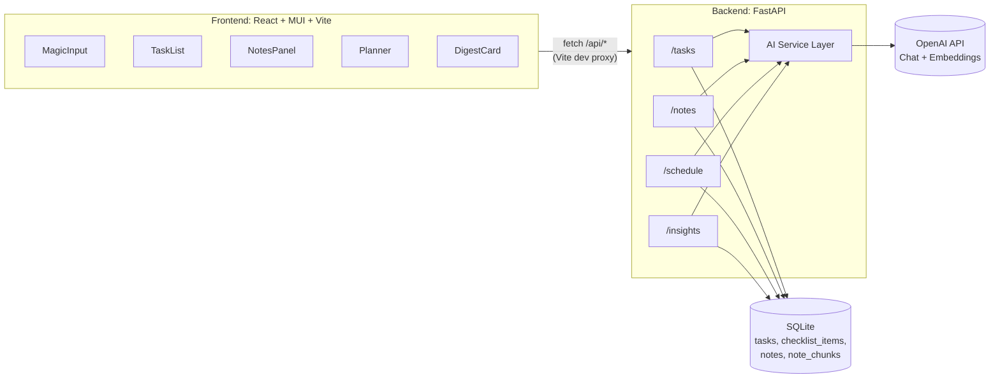

# Архитектура проекта "AI-Органайзер"

Документ фиксирует стек технологий и архитектуру приложения перед
началом реализации. Источник требований: [spec.md](spec.md).

## Ключевые решения

- Реализуется **весь функционал спецификации**: Magic Input,
  AI-декомпозиция задач, AI-заметки с семантическим поиском,
  адаптивный планировщик, вечерний AI-дайджест.
- Режим работы: **однопользовательский, локальный**, без
  регистрации и логина.
- Архитектура: отдельные **backend** (FastAPI) и **frontend**
  (React + MUI, Vite), взаимодействующие по REST API.

## Стек технологий

### Backend

- **Python 3** — язык реализации.
- **FastAPI** — REST API, асинхронность, автогенерация OpenAPI.
- **SQLAlchemy** — ORM поверх **SQLite** (файл БД).
- **Pydantic / pydantic-settings** — схемы запросов/ответов и
  конфигурация из `.env`.
- **OpenAI Python SDK** — интеграция с моделями:
  - `OPENAI_CHAT_MODEL` (`gpt-4o-mini`) — парсинг, декомпозиция,
    автотеги, форматирование текста, reschedule, дайджест;
  - `EMBEDDING_MODEL` (`text-embedding-3-small`) — эмбеддинги для
    семантического поиска по заметкам.
- **uvicorn** — ASGI-сервер.
- **logging** (стандартная библиотека) — вместо `print`.
- **ruff / black / isort** — линтер и форматтер, `line-length = 79`
  под принятые стайл-правила.

### Frontend

- **Node.js + npm** — окружение и пакетный менеджер.
- **React** — UI-библиотека.
- **Material UI (MUI)** — компоненты интерфейса (кнопки, списки,
  диалоги, чипы тегов).
- **Vite** — сборка и dev-сервер (`npm run dev/build/preview`).
- **ESLint + Prettier** — линтер и форматтер JS/JSX.
- **localStorage** — хранение истории последних введённых строк
  Magic Input на клиенте (не основное хранилище данных).

### Хранение данных

- **SQLite** — единственный источник истины для задач, чек-листов
  и заметок (файл `backend/data/app.db`).
- Векторный поиск не выносится во внешнюю БД: эмбеддинги хранятся
  как JSON-поле в SQLite, косинусная близость считается в Python
  (достаточно для локального однопользовательского масштаба).

## Архитектурная диаграмма



В dev-режиме фронтенд обращается к бэкенду через прокси Vite
(`/api -> http://localhost:18080`), что снимает необходимость в
CORS-настройках при разработке. CORS middleware на бэкенде всё
равно включается для устойчивости при других сценариях запуска.

## Структура проекта

```
02-AI_Organaizer/
  spec.md
  architecture.md
  .env                  # существующий, с секретами (в .gitignore)
  .env.example          # шаблон без секретов
  .gitignore
  README.md
  backend/
    app/
      main.py            # FastAPI app, CORS, роутеры, логирование
      config.py           # pydantic-settings, читает .env
      database.py          # SQLAlchemy engine/session
      models.py             # Task, ChecklistItem, Note, NoteChunk
      schemas.py             # Pydantic-схемы запросов/ответов
      routers/
        tasks.py
        notes.py
        schedule.py
        insights.py
      services/
        openai_client.py     # обёртка над OpenAI SDK
        capture.py            # парсинг Magic Input -> задача
        decompose.py           # разбивка задачи на шаги/подсказки
        notes_ai.py             # автотеги, связи, форматирование
        embeddings.py            # embeddings, cosine similarity
        scheduler.py              # приоритеты (Эйзенхауэр), reschedule
        digest.py                  # вечерний дайджест
    requirements.txt
    pyproject.toml         # ruff/black/isort (line-length=79)
  frontend/
    src/
      main.jsx
      App.jsx
      theme.js
      api/client.js         # fetch-обёртка, baseURL через Vite proxy
      components/
        MagicInput.jsx
        TaskList.jsx / TaskItem.jsx
        ChecklistDialog.jsx
        NotesPanel.jsx / NoteEditor.jsx / AskNotesBar.jsx
        Planner.jsx           # матрица Эйзенхауэра / фокус на день
        DigestCard.jsx
    vite.config.js         # dev-proxy /api -> localhost:18080
    package.json
    .eslintrc.cjs / .prettierrc
```

## Модель данных (SQLite)

| Сущность | Поля |
| --- | --- |
| **Task** | `id, title, raw_input, description, due_at, tag, is_urgent, is_important, status(pending/in_progress/done), created_at, updated_at` |
| **ChecklistItem** | `id, task_id (FK), text, is_done, position, created_at` |
| **Note** | `id, title, content, tags(JSON), linked_task_id (FK, nullable), created_at, updated_at` |
| **NoteChunk** | `id, note_id (FK), text, embedding(JSON[float])` |

Заметка режется на абзацы; каждый абзац (`NoteChunk`) получает свой
embedding, чтобы семантический поиск находил конкретный релевантный
фрагмент, а не всю заметку целиком.

## Точки интеграции с OpenAI

1. **Magic Input** — парсинг свободного текста в структурированную
   задачу (`title`, `due_at`, `tag`).
2. **Декомпозиция задач** — генерация чек-листа шагов и
   контекстных подсказок по недостающим подзадачам.
3. **Автотегирование заметок** — теги и предложение связей с
   задачами/проектами при создании/редактировании заметки.
4. **Семантический поиск** — эмбеддинги вопроса и абзацев заметок,
   выдача релевантных фрагментов ("Спроси свои заметки").
5. **Быстрое форматирование** — summary / исправление грамматики /
   смена тона для выделенного фрагмента заметки.
6. **Smart Rescheduling** — анализ загруженности дня и предложение
   нового окна для просроченной задачи.
7. **Вечерний дайджест** — агрегация статистики дня (% выполнения,
   продуктивные часы) и генерация текстового отчёта-рекомендации.

## API (обзор эндпоинтов)

- `GET/POST/PATCH/DELETE /tasks`, `DELETE /tasks` (очистить список)
- `POST /tasks/parse` — Magic Input -> черновик задачи
- `POST /tasks/{id}/decompose` — генерация чек-листа
- `POST /tasks/{id}/reschedule` — предложение нового времени
- `GET/POST/PATCH/DELETE /notes`
- `POST /notes/ask` — семантический поиск по заметкам
- `POST /notes/{id}/transform` — summary/грамматика/тон
- `GET /schedule/today` — приоритеты дня (матрица Эйзенхауэра)
- `GET /insights/digest` — вечерний AI-дайджест

## Примечания

- `.env` уже содержит боевой ключ OpenAI — обязательно должен быть
  добавлен в `.gitignore`; в репозиторий попадает только
  `.env.example` без секретов.
- Настоящий документ фиксирует архитектуру на момент планирования;
  при изменении решений в ходе реализации файл следует обновлять.
